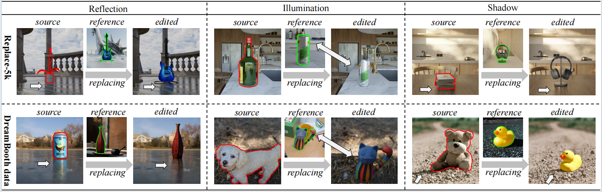

<div align="center">
<h3>PS-Diffusion: Photorealistic Subject-Driven Image Editing with Disentangled Control and Attention</h3>


---

[**Weicheng Wang**]<sup>1</sup> · [**Guoli Jia**](https://exped1230.github.io//)<sup>3</sup> · [**Zhongqi Zhang**]<sup>1</sup> · [**Liang Lin**]<sup>2,4</sup> · [**Jufeng Yang**](https://cv.nankai.edu.cn/)<sup>1,2,5</sup>

<sup>1</sup>VCIP & TMCC & DISSec, College of Computer Science, Nankai University, Tianjin, China.

<sup>2</sup>Pengcheng Laboratory, Shenzhen, China.

<sup>3</sup>Electrical Engineering Department, Tsinghua University, Beijing, China.

<sup>4</sup>School of Computer Science and Engineering, Sun Yat-sen University, Guangzhou, China.

<sup>5</sup>Nankai International Advanced Research Institute (SHENZHEN·FUTIAN), Shenzhen, China.

<h3>CVPR 2025</h3>

<a href='https://github.com/wei-cheng777/PS-Diffusion'></a>
<a href='https://github.com/wei-cheng777/PS-Diffusion'></a>


## Abstract

**Diffusion models pre-trained on large-scale paired image-text data achieve significant success in image editing. To convey more fine-grained visual details, subject-driven editing integrates subjects in user-provided reference images into existing scenes. However, it is challenging to obtain photorealistic results, which simulate contextual interactions, such as reflections, illumination, and shadows, induced by merging the target object into the source image. To address this issue, we propose PS-Diffusion, which ensures realistic and consistent object-scene blending while maintaining the invariance of subject appearance during editing. To be specific, we first divide the contextual interactions into those occurring in the foreground and the background areas. The effect of the former is estimated through intrinsic image decomposition, and the region of the latter is predicted in an additional background effect control branch. Moreover, we propose an effect attention module to disentangle the learning processes of interaction and subject, alleviating confusion between them. Additionally, we introduce a synthesized dataset, Replace-5K, consisting of 5,000 image pairs with invariant subject and contextual interactions via 3D rendering. Extensive quantitative and qualitative experiments on our dataset and two real-world datasets demonstrate that our method achieves state-of-the-art performance.**

</div>

## News

* **2025-03-19:** The processed dataset Replace-5K have been made public！
* **2025-03-19:** The trained weights of PS-Diffusion have been made public！
* **2025-03-19:** The PS-Diffusion repo is created！
* **2025-02-29:** The PS-Diffusion is accepted by CVPR 2025！

## TODO List

- [ ] Gradio for inference
- [ ] Detailed training details
- [x] Paper release
- [x] Dataset release
- [x] Weight release

## Get Start


#### 1. Requirements

A suitable conda environment can be created
and activated with:

```
conda  create -n envname python=3.8
conda activate envname
```

Make sure you have all the dependencies listed in requirements.txt installed.   
If not, Install them using
```
pip install -r requirements.txt
```

#### 2. Download Datasets and Checkpoints.

##### Datasets:

We introduce an exquisite synthetic dataset, Replace-5k, comprising 5,000 image pairs that simulate the physical effects of various scenes on objects.

| Datasets | [BaiduNetdisk](https://pan.baidu.com/s/1xDFDkWnOOQXubqETX1IKkg?pwd=jkak) |
| :------: | :----------------------------------------------------------: |

##### Weights:

The weights we trained can be downloaded via the link below. You should create a folder named 'weights' under the project directory and put the two weights files in this folder

| Weights |[BaiduNetdisk](https://pan.baidu.com/s/1QBmeLGl_rkVJM0SA08hkvw?pwd=amve)|
| :-----: | :----------------------------------------------------------: |

##### 

#### 3. Checkpoint:

Change the path to line 85 of /config/ps-diffusion.yaml

Change the path to line 1 and 2 of/config/inference.yaml 


#### 4. Inference for examples

~~~
# We provide test examples in the examples folder
bash run_inf.sh
~~~

#### 5. Training

~~~
python run_train_psdiffusion.py
~~~

## Contact

If you have any questions, please feel free to contact me:

1394828098wwc@gmail.com or 2120230639@mail.nankai.edu.cn

## Acknowledgements
This project is based on the codebase of [ControlNet](https://github.com/lllyasviel/ControlNet) and [AnyDoor](https://github.com/ali-vilab/AnyDoor). We  appreciate these great works! 


