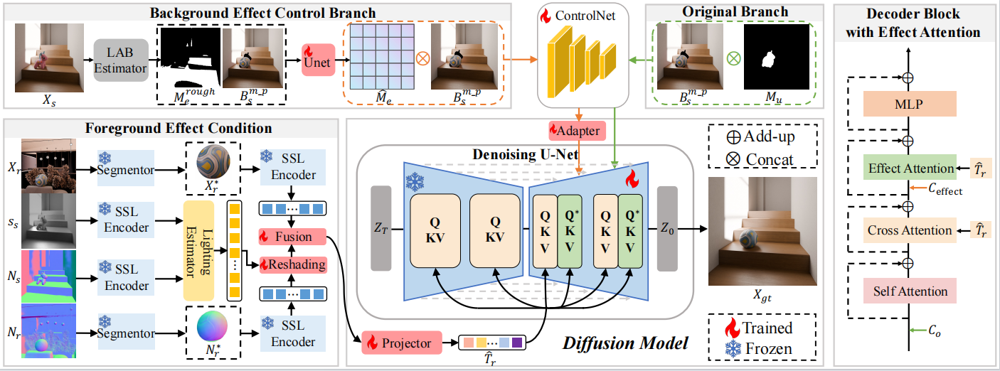

<div align="center">
<h3>PS-Diffusion: Photorealistic Subject-Driven Image Editing with Disentangled Control and Attention</h3>


---

[**Weicheng Wang**]<sup>1</sup> · [**Guoli Jia**](https://exped1230.github.io//)<sup>3</sup> · [**Zhongqi Zhang**]<sup>1</sup> · [**Liang Lin**]<sup>2,4</sup> · [**Jufeng Yang**](https://cv.nankai.edu.cn/)<sup>1,2,5</sup>

<sup>1</sup>VCIP & TMCC & DISSec, College of Computer Science, Nankai University, Tianjin, China.

<sup>2</sup>Pengcheng Laboratory, Shenzhen, China.

<sup>3</sup>Electrical Engineering Department, Tsinghua University, Beijing, China.

<sup>4</sup>School of Computer Science and Engineering, Sun Yat-sen University, Guangzhou, China.

<sup>5</sup>Nankai International Advanced Research Institute (SHENZHEN·FUTIAN), Shenzhen, China.

**CVPR 2025**

<a href='https://github.com/wei-cheng777/PS-Diffusion'></a>
<a href='https://zhongqihebut.github.io/ps_diffusion/'></a>
</div>


Figure 1. Results from our proposed Replace-5K and real-world data in DreamBooth are shown.


Figure 2. Pipeline of our method.

## 1. News

* **2025-02-27:** PS-Diffusion has been accepted to **CVPR 2025**！


## 2. Get Start


#### 1. Requirements

A suitable conda environment can be created
and activated with:

```
conda  create -n envname python=3.8
conda activate envname
```

Make sure you have all the dependencies listed in requirements.txt installed.   
If not, Install them using
```
pip install -r requirements.txt
```

#### 2. Download Datasets and Checkpoints.

##### Datasets:

We introduce an exquisite synthetic dataset, Replace-5k, comprising 5,000 image pairs that simulate the physical effects of various scenes on objects.

| Datasets | [BaiduNetdisk]https://pan.baidu.com/s/1xDFDkWnOOQXubqETX1IKkg?pwd=jkak |
| :------: | :----------------------------------------------------------: |

##### Weights:

The weights we trained can be downloaded via the link below. You should create a folder named 'weights' under the project directory and put the two weights files in this folder

| Weights |[BaiduNetdisk]https://pan.baidu.com/s/1QBmeLGl_rkVJM0SA08hkvw?pwd=amve|
| :-----: | :----------------------------------------------------------: |

##### 

#### 3. Checkpoint:

Change the path to line 85 of /config/ps-diffusion.yaml

Change the path to line 1 and 2 of/config/inference.yaml 


#### 4. Inference

~~~
python run_inference.py
~~~


## Contact

If you have any questions, please feel free to contact me:

2120230639@mail.nankai.edu.cn


